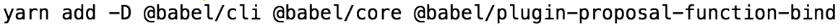
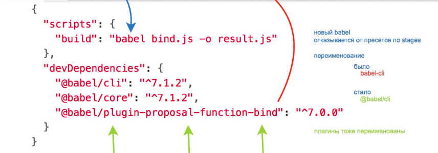
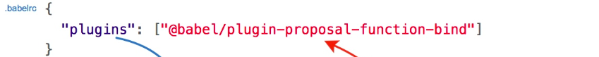
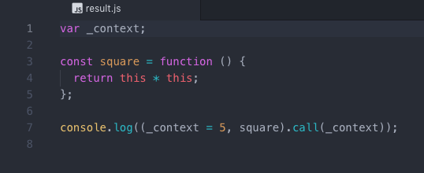
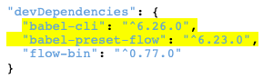
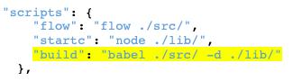
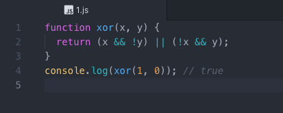

1. Проблема: необходимо преобразовать данный код в изоморфный, дабы он выполнялся во всех местах, подразумевающих выполнение js кода.
```js 
const square = function(){ return this * this };
console.log(5::square()); 
```
Решение: необходимо установить babel - компилятор, выражающий такие новомодные выражения языка в его более классической форме.


прописываем данный код в терминале в папке проекта, для добавления babel непосредственно в ваш проект 
и прописывания этого 

 

в ваш json файл

создаем в проекте файл с именем .babelrc с данным текстом 

далее прописываем наш код в bind.js и по выполнении команды "yarn build" в терминале получаем result.js с исправленным кодом



2. Проблема: есть данный код НЕ на языке JS а на чем-то похожем, но с строгим определением типа
```js
// @flow
function xor(x: boolean, y: boolean): boolean {
return (x && !y) || (!x && y);
}
console.log(xor(1, 0)); // true
```

данный код требует транспиляции (babel):

данный код необходимо прописать в package.json:



это необходимо прописать там же:



 инициализация для корректной работы:
```
yarn flow init
```

Теперь, если мы создадим js файл с нашим кодом в дирректории src и выплоним 
```
yarn build
```
теперь в папке lib появился файл с таким же названием, но измененный - изоморфный



# а на сегодня все, за результатами см. консоль

<script src='result.js'></script>
<script src='1.js'></script>
